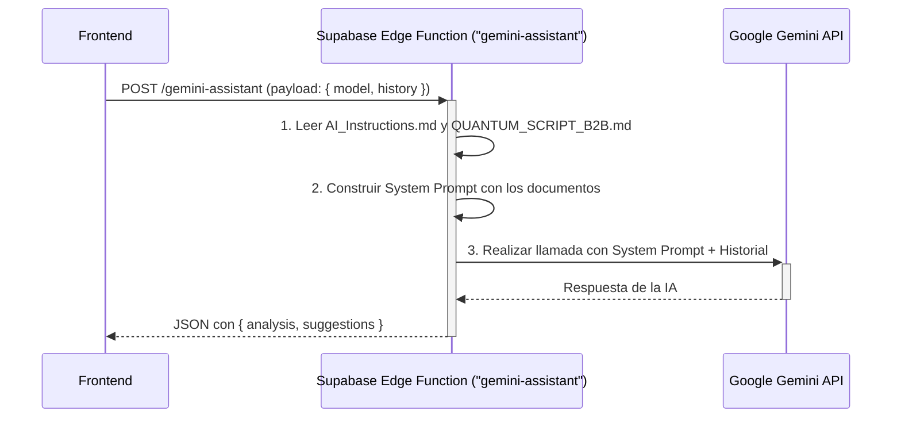
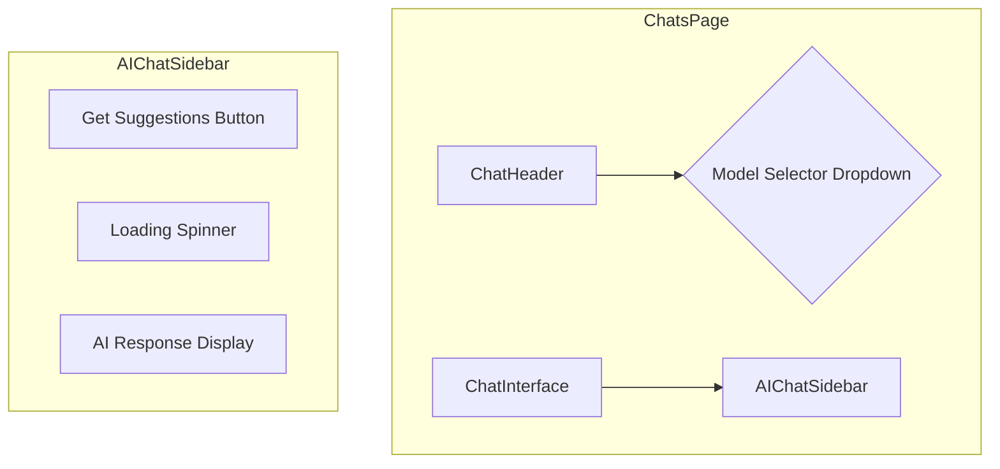

# Plan de Implementación: Asistente de IA para Chats

Este documento describe la arquitectura y el plan de implementación para integrar un asistente de IA en la página de chats, basado en los modelos de Gemini y el conocimiento específico de Quantum Creators.

## 1. Análisis de Requisitos

- **Funcionalidad Principal:** Asistente de IA que sugiere respuestas a los appointment setters.
- **Modelos de IA:** Selector para `gemini-2.5-flash` y `gemini-2.5-pro`.
- **Conocimiento Base:** La IA se basará estrictamente en `appointment_setting/AI_Instructions.md` y `appointment_setting/QUANTUM_SCRIPT_B2B.md`.
- **Integración Técnica:** Utilizar claves de API de Gemini desde un fichero `.env`, accedidas de forma segura a través de un backend.

## 2. Plan de Implementación

El plan se divide en tres fases: Backend, Frontend y Gestión de Estado.

### Fase 1: Backend - Endpoint Seguro (Supabase Edge Function)

Para proteger las claves de API y centralizar la lógica del prompt, se creará una Supabase Edge Function.

**Diagrama de Flujo:**


**Pasos:**
1.  **Crear Edge Function:** En `supabase/functions/gemini-assistant/index.ts`.
2.  **Cargar Conocimiento:** Leer los ficheros `.md` dentro de la función para construir el prompt.
3.  **Llamar a Gemini:** Usar la clave de API desde las variables de entorno de Supabase.
4.  **Devolver Respuesta Estructurada:** Enviar un JSON con el análisis y las sugerencias.

### Fase 2: Frontend - Componentes de Interfaz (React)

Se modificarán los componentes existentes para integrar la nueva funcionalidad.

**Diagrama de Componentes:**


**Pasos:**
1.  **Selector de Modelo:** Añadir un `Dropdown` en `src/components/Chat/ChatHeader.tsx`.
2.  **Panel del Asistente:** Desarrollar la UI en `src/components/Chat/AIChatSidebar.tsx` para el botón, el estado de carga y la visualización de las sugerencias con botones para copiar.

### Fase 3: Gestión de Estado y Flujo de Datos

Se conectará el frontend con el backend y se gestionará el estado.

**Diagrama de Flujo de Datos:**
```mermaid
graph TD
    subgraph User Interaction
        A(User clicks "Get Suggestions") --> B{handleGetSuggestions};
    end

    subgraph State Management (useAIAssistant Hook)
        B --> C[Set isLoading = true];
        C --> D{Get chat history & selected model};
        D --> E[Invoke Supabase Function];
        E -- Success --> F[Set aiResponse, isLoading = false];
        E -- Error --> G[Set error, isLoading = false];
    end

    subgraph UI Update
        F --> H(Render AI response in AIChatSidebar);
        G --> I(Render error message in AIChatSidebar);
    end
```

**Pasos:**
1.  **Crear Hook `useAIAssistant.ts`:** Encapsulará la lógica de la llamada a la API, el estado de carga (`isLoading`), la respuesta (`aiResponse`) y los errores (`error`).
2.  **Integrar en `ChatsPage.tsx`:** Usar el hook y pasar las funciones y el estado a los componentes hijos (`ChatHeader`, `AIChatSidebar`).
3.  **Invocar la Función:** Usar `supabase.functions.invoke()` dentro del hook.

## 3. Resumen del Flujo de Trabajo del Usuario Final

1.  El usuario selecciona el modelo de Gemini.
2.  Hace clic en "Obtener Sugerencias".
3.  El panel lateral muestra un indicador de carga.
4.  Aparecen el análisis y las 3 sugerencias.
5.  El usuario copia la sugerencia deseada y la pega en el input del chat.

## 4. Próximos Pasos y Consideraciones

- Implementar una UI clara para la gestión de errores.
- Considerar el streaming de respuestas para mejorar la UX.
- Monitorizar el uso y los costos de la API.
- Añadir Rate Limiting en la Edge Function para prevenir abusos.